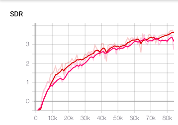
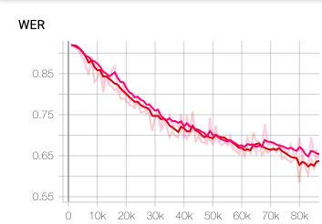

# Minimum Word Error Rate Training for Speech Separation
Minimum word error training approach using VoiceFilter and DeepSpeech.

## Result
- Train dataset: 281,241 mixture
- Validation dataset: 80 mixture
- Test dataset: 5,567 mixture
- Batch size: 8 
- hardware: NVIDIA Tesla V100 PCIe 32 GB

### Metric
- Result based on 80,000 iteration.
- The test dataset is fully mixed, therefore, both SDR and WER of the original mixture is already poor.
- To compare to the performance of original, need to use partially mixed dataset.

| System             | Mean SDR (dB) | Mean WER (%) |
| ---------------------- | ----- | ---- |
| Before Separation     |  0.10  |  92.7 |
| Ours      | 4.09  | 55.7 |
| VoiceFilter      | 3.99  | 59.2 |




- The red line is ours, the pink line is voicefilter.

## Installation

### Deepspeech
- Download relevent pretraind model
```
wget https://github.com/mozilla/DeepSpeech/releases/download/v0.5.0/deepspeech-0.5.0-models.tar.gz
tar xvfz deepspeech-0.5.0-models.tar.gz
```
- Install python packages
```
  pip install -r requirement.txt
```
- Run the 8 clients code with a port number
```
  python client 8080
  python client 8081
  ...
  python client 8087
```
### VoiceFilter
- Follow the instruction in original [README.md](voicefilter)
- The major contributions are [new loss function](https://github.com/thejungwon/mwetss/blob/a16c7f44b5d6ea0c115748e4e6ef53cd74abcbc1/voicefilter/utils/train.py#L17-L24) and [WER calculator](https://github.com/thejungwon/mwetss/blob/master/voicefilter/utils/worderrorrate.py).
## License

Apache License 2.0

This repository contains codes adapted/copied from the followings:
- [deepspeech-flask](deepspeech-flask) from https://github.com/mozilla/DeepSpeech (Mozilla Public License 2.0)
- [voicefilter](voicefilter) from https://github.com/mindslab-ai/voicefilter (Apache License 2.0)
